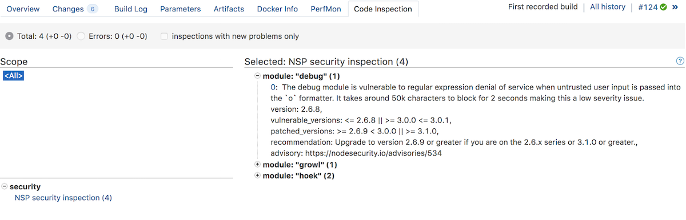

## nsp reporter for TeamCity

Generates TeamCity inspections from [nsp][nsp] report


### Installation
1. Install packages
```
npm i -D nsp nsp-reporter-teamcity
```
or, in case of `yarn`
```
npm i -D nsp nsp-reporter-teamcity nsp-preprocessor-yarn
```
2. Add npm scripts to run checks locally and in a CI server, e.g.:
```
"nsp": "nsp check --preprocessor yarn",
"nsp:ci": "nsp check --reporter teamcity --preprocessor yarn"
```
(just drop `--preprocessor yarn` in case of `npm`)

3. Configure build step in TeamCity
e.g. Command Line runner with script to install dependencies and run checks:
```
yarn
yarn nsp:ci
```

### Configuration
Put `nsp.conf.json` config file in a project root directory to override any of the dafault values:

```json
{
  "nspInspectionTypeId": "nsp-security-inspection",
  "nspInspectionName": "NSP security inspection",
  "nspInspectionCategory": "security",
  "npsInspectionSeverity": "WARNING"
}
```

[nsp]: https://www.npmjs.com/package/nsp
